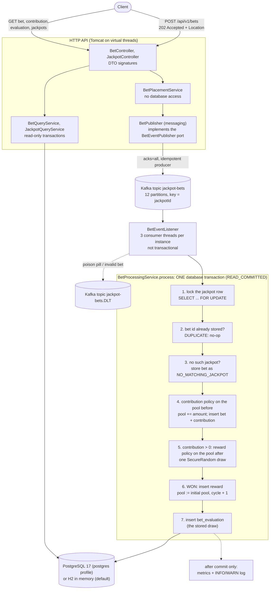

# Jackpot Service

[](https://github.com/demean/SportyAssignment/actions/workflows/ci.yml)

A Spring Boot 4.1 / Java 21 backend for the Sporty Group Jackpot home assignment. It accepts bets over HTTP and
publishes them to the Kafka topic `jackpot-bets`. A consumer then processes each bet in **one database transaction**,
under the jackpot's row lock: (1) it adds the bet's contribution to the matching jackpot pool and (2) it evaluates the
bet for the jackpot reward, paying out and resetting the pool on a win. Each jackpot has its own contribution rule
and reward rule (fixed or variable today). The rules are sealed policy types, so a new one is a small, compiler-checked
change. REST endpoints return the processed bet, its contribution and whether it won. The full stack (Kafka in KRaft
mode, PostgreSQL, Kafka UI and the service) runs with one `docker compose` command. The service can also run on the
host with the in-memory H2 database.

**Candidate: Dmitriy Globenko**

| | |
|---|---|
| Stack | Java 21, Spring Boot 4.1.1, Spring Kafka 4.1.1, Hibernate 7.4, Flyway 12.4, Kafka 4.2.1 (KRaft), PostgreSQL 17 / H2 2.4 |
| Build | `./mvnw verify`: 997 tests, JaCoCo gate at 100 % on all six counters, no excludes |
| Run | `docker compose up --build`, then open http://localhost:8080/swagger-ui.html |

## Contents

1. [Quick start](#1-quick-start)
2. [60-second walkthrough (real output)](#2-60-second-walkthrough-real-output)
3. [Other run modes and configuration](#3-other-run-modes-and-configuration)
4. [API reference and error model](#4-api-reference-and-error-model)
5. [Architecture](#5-architecture)
6. [Domain model: jackpots, policies, money](#6-domain-model-jackpots-policies-money)
7. [Assumptions and interpretations](#7-assumptions-and-interpretations)
8. [Traps we handled](#8-traps-we-handled)
9. [Transactions and delivery semantics](#9-transactions-and-delivery-semantics)
10. [Consumer error handling, dead-letter topic and replay](#10-consumer-error-handling-dead-letter-topic-and-replay)
11. [Scaling and performance](#11-scaling-and-performance)
12. [Observability](#12-observability)
13. [Testing](#13-testing)
14. [Extending: adding a policy](#14-extending-adding-a-policy)
15. [Project structure](#15-project-structure)
16. [Tech stack](#16-tech-stack)
17. [AI usage](#17-ai-usage)

---

## 1. Quick start

| You need | For |
|---|---|
| Docker Engine with Compose v2 | the all-in-one stack (verified with Docker Engine 29.5 on colima, Compose v5.5.1) |
| JDK 21 | host runs and the test suites (`./mvnw` downloads Maven 3.9.9 itself) |
| Free host ports 8080, 8081, 8090, 9092, 5432 | 5432 can be moved with `POSTGRES_HOST_PORT` |

```bash
docker compose up --build        # add -d to run in the background
```

The image is built inside Docker (a multi-stage Maven build), so no local JDK is needed for this step. The service
waits for healthy Kafka and PostgreSQL containers. On a 2-CPU / 4 GB colima VM it reported `Started
JackpotServiceApplication in 48.9 seconds`. It is ready once `docker compose ps` shows `jackpot-jackpot-service-1 ...
(healthy)`.

| What | URL |
|---|---|
| REST API | http://localhost:8080/api/v1/jackpots |
| Swagger UI | http://localhost:8080/swagger-ui.html (redirects to `/swagger-ui/index.html`) |
| OpenAPI 3.1 JSON | http://localhost:8080/v3/api-docs |
| Health (management port) | http://localhost:8081/actuator/health, `/actuator/health/liveness`, `/actuator/health/readiness` |
| Prometheus metrics | http://localhost:8081/actuator/prometheus |
| Kafka UI (kafbat) | http://localhost:8090 (cluster `jackpot`) |
| Kafka from the host | `localhost:9092` |
| PostgreSQL from the host | `localhost:5432` (or `POSTGRES_HOST_PORT`), database, user and password `jackpot` |

`docker compose down` stops the stack and keeps its data: the database, the topics and the consumer offsets live in
the named volumes `jackpot_postgres-data` and `jackpot_kafka-data`. `docker compose down -v` also deletes them, so the
next `up` starts with freshly seeded jackpots.

| Symptom | Fix |
|---|---|
| Port 5432 is already in use | `POSTGRES_HOST_PORT=15432 docker compose up --build` |
| `buildx Docker CLI plugin not found: falling back to the classic builder` | This is only a warning. The Dockerfile uses no BuildKit-only syntax, so the classic builder builds it. If the build still fails, pre-build the image with the legacy builder and start without `--build`: `DOCKER_BUILDKIT=0 docker build -t jackpot-service:1.0.0 . && docker compose up` |
| `error listing credentials ... "docker-credential-desktop": executable file not found` | A stale Docker Desktop setting, common after switching to colima. Remove `"credsStore": "desktop"` from `~/.docker/config.json`. |

## 2. 60-second walkthrough (real output)

The outputs below were captured from a fresh `docker compose up --build` (after `docker compose down -v`, if the
stack had run before). JSON is pretty-printed and long lists are trimmed. Processing is asynchronous: until the consumer has processed a bet, its GET endpoints answer
`404 BET_NOT_FOUND`, so clients poll. This took tens of milliseconds in practice. The first bet after startup took
about 1 s.

To replay the walkthrough, run **`scripts/demo.sh`** (bash + curl only). It uses new bet ids on every run, polls for
the result and checks every step. Before it reads a jackpot's state, it waits until earlier bets on that jackpot have
been consumed (a 0.01 marker bet, which contributes 0.00 and is never drawn), so a consumer backlog right after a
restart cannot break its checks. It exits with 0 when all checks pass. The same requests are in
**`http/jackpot.http`** for the IntelliJ or VS Code REST client. Bet ids are idempotency keys, so to repeat the
commands below on the same stack you need new ids.

**1. The seeded jackpots.** `jackpot-lucky` is set up for a deterministic win.

```bash
curl -s http://localhost:8080/api/v1/jackpots/jackpot-lucky
```
```json
{
  "id": "jackpot-lucky", "name": "Lucky Demo",
  "initialPoolAmount": 100.00, "currentPoolAmount": 100.00, "cycle": 1,
  "contributionPolicy": {"type": "VARIABLE", "parameters": {"startPercentage": 20.0, "minPercentage": 5.0, "decayPercentage": 1.0, "poolIncreaseStep": 100}},
  "rewardPolicy": {"type": "VARIABLE", "parameters": {"startChancePercentage": 5.0, "chanceIncreasePercentage": 10.0, "poolIncreaseStep": 10, "poolLimit": 150}},
  "updatedAt": "2026-09-23T00:16:17.798427Z"
}
```

**2. Place a 250.00 bet.** The API publishes it to Kafka and answers once the broker has acknowledged it.

```bash
curl -si -X POST http://localhost:8080/api/v1/bets -H 'Content-Type: application/json' \
  -d '{"betId":"bet-1001","userId":"user-42","jackpotId":"jackpot-lucky","betAmount":250.00}'
```
```text
HTTP/1.1 202
Location: /api/v1/bets/bet-1001
Content-Type: application/json

{"betId":"bet-1001","jackpotId":"jackpot-lucky","status":"ACCEPTED","acceptedAt":"2026-09-23T00:17:15.855975Z"}
```

**3. Did it win?** The bet contributed 20 % (50.00), which brings the pool to 150.00. That reaches `poolLimit` 150, so
the win chance is 100 %.

```bash
curl -s http://localhost:8080/api/v1/bets/bet-1001/evaluation
```
```json
{
  "betId": "bet-1001", "userId": "user-42", "jackpotId": "jackpot-lucky",
  "outcome": "WON", "won": true, "rewardAmount": 150.00, "winChancePercentage": 100.0000,
  "evaluatedAt": "2026-09-23T00:17:16.874435Z"
}
```

**4. The contribution record.** `currentJackpotAmount` is the pool right after this bet.

```bash
curl -s http://localhost:8080/api/v1/bets/bet-1001/contribution
```
```json
{
  "betId": "bet-1001", "userId": "user-42", "jackpotId": "jackpot-lucky",
  "stakeAmount": 250.00, "contributionAmount": 50.00, "currentJackpotAmount": 150.00,
  "createdAt": "2026-09-23T00:17:16.874435Z"
}
```

**5. The jackpot was reset** to its initial pool and started cycle 2.

```bash
curl -s http://localhost:8080/api/v1/jackpots/jackpot-lucky
```
```json
{ "id": "jackpot-lucky", "name": "Lucky Demo", "initialPoolAmount": 100.00, "currentPoolAmount": 100.00, "cycle": 2, "...": "...",
  "updatedAt": "2026-09-23T00:17:16.874435Z" }
```

**6. A normal bet on `jackpot-fixed`** (5 % contribution, fixed 1 % chance, so the outcome is random):

```bash
curl -s -X POST http://localhost:8080/api/v1/bets -H 'Content-Type: application/json' \
  -d '{"betId":"bet-1002","userId":"user-42","jackpotId":"jackpot-fixed","betAmount":100.00}'
curl -s http://localhost:8080/api/v1/bets/bet-1002/evaluation
curl -s http://localhost:8080/api/v1/bets/bet-1002/contribution
```
```json
{"betId":"bet-1002","jackpotId":"jackpot-fixed","status":"ACCEPTED","acceptedAt":"2026-09-23T00:17:27.761322Z"}
{"betId":"bet-1002","userId":"user-42","jackpotId":"jackpot-fixed","outcome":"LOST","won":false,"rewardAmount":0.00,"winChancePercentage":1.0000,"evaluatedAt":"2026-09-23T00:17:28.022331Z"}
{"betId":"bet-1002","userId":"user-42","jackpotId":"jackpot-fixed","stakeAmount":100.00,"contributionAmount":5.00,"currentJackpotAmount":1005.00,"createdAt":"2026-09-23T00:17:28.022331Z"}
```

Posting `bet-1002` again also answers `202`, because the API does not read the database. The consumer then ignores it
as a duplicate, and `GET /api/v1/jackpots/jackpot-fixed` still shows `"currentPoolAmount":1005.00`.

**7. A bet for an unknown jackpot** is stored, but it does not contribute and is not evaluated:

```bash
curl -s -X POST http://localhost:8080/api/v1/bets -H 'Content-Type: application/json' \
  -d '{"betId":"bet-1003","userId":"user-42","jackpotId":"jackpot-unknown","betAmount":10.00}'
curl -s http://localhost:8080/api/v1/bets/bet-1003
curl -s http://localhost:8080/api/v1/bets/bet-1003/evaluation
```
```json
{"betId":"bet-1003","jackpotId":"jackpot-unknown","status":"ACCEPTED","acceptedAt":"2026-09-23T00:17:32.284601Z"}
{"betId":"bet-1003","userId":"user-42","jackpotId":"jackpot-unknown","betAmount":10.00,"status":"NO_MATCHING_JACKPOT","placedAt":"2026-09-23T00:17:32.284601Z","processedAt":"2026-09-23T00:17:32.436981Z"}
{"detail":"Bet 'bet-1003' was processed but did not contribute to a jackpot (no matching jackpot)","instance":"/api/v1/bets/bet-1003/evaluation","status":422,"title":"Unprocessable Content","code":"BET_NOT_CONTRIBUTING","timestamp":"2026-09-23T00:17:34.468921Z"}
```

## 3. Other run modes and configuration

### Infrastructure in Docker, service on the host (default profile: in-memory H2)

If the full stack from §1 is running, stop its service container first: `docker compose stop jackpot-service` (it
holds ports 8080 and 8081). On colima the conflict is silent: the container keeps `127.0.0.1:8080` and the host
application gets `[::1]:8080`, so `curl localhost` and a Java-based HTTP client reach different instances.

```bash
docker compose up -d kafka kafka-ui           # add "postgres" for the postgres profile below
export JAVA_HOME=/path/to/jdk-21
./mvnw spring-boot:run
```

* The database is H2 in memory: all data is lost on restart. The consumer group keeps its Kafka offsets, so bets
  consumed before a restart are **not** replayed into the new database. The service logs a WARN at startup: H2
  supports one instance only. Flyway also warns that H2 2.4.240 is newer than the versions it has verified. The
  migrations run on that version in every build, so this warning is harmless.
* The actuator runs on the API port here: http://localhost:8080/actuator/health. On a laptop the service started in
  about 9 s.
* The consumer group is `jackpot-service-local`, not the compose service's `jackpot-service`, so a local run never
  takes partitions from a PostgreSQL deployment on the same broker. A consumer group seen for the first time starts
  at the **earliest** offset, so it processes whatever is already in `jackpot-bets`. For example, a postgres-profile
  run on the same broker also processed the bets of an earlier H2 run.
* `scripts/demo.sh` works against it unchanged.

### Service on the host with PostgreSQL (`postgres` profile)

```bash
docker compose up -d kafka postgres kafka-ui
./mvnw spring-boot:run -Dspring-boot.run.profiles=postgres
# PostgreSQL moved with POSTGRES_HOST_PORT=15432? Point the service at it:
POSTGRES_URL=jdbc:postgresql://localhost:15432/jackpot ./mvnw spring-boot:run -Dspring-boot.run.profiles=postgres
```

The actuator moves to port 8081, as in Docker. Do not run this while the `jackpot-service` container is up, because
both use ports 8080 and 8081: stop it first with `docker compose stop jackpot-service`.

### Environment variables

| Variable | Default | Effect |
|---|---|---|
| `SPRING_PROFILES_ACTIVE` | none (H2) | `postgres` switches to PostgreSQL and puts the actuator on port 8081; compose sets it |
| `KAFKA_BOOTSTRAP_SERVERS` | `localhost:9092` | Kafka bootstrap servers (compose: `kafka:29092`) |
| `POSTGRES_URL` | `jdbc:postgresql://localhost:5432/jackpot` | JDBC URL (`postgres` profile) |
| `POSTGRES_USER` / `POSTGRES_PASSWORD` | `jackpot` / `jackpot` | database credentials (`postgres` profile) |
| `JACKPOT_FIXED_INITIAL_POOL` | `1000.00` | initial pool of `jackpot-fixed` |
| `JACKPOT_VARIABLE_INITIAL_POOL` | `5000.00` | initial pool of `jackpot-variable` |
| `JACKPOT_MIXED_INITIAL_POOL` | `10000.00` | initial pool of `jackpot-mixed` |
| `JACKPOT_LUCKY_INITIAL_POOL` | `100.00` | initial pool of `jackpot-lucky` (the walkthrough assumes 100.00) |
| `JACKPOT_CONSUMER_GROUP` | `jackpot-service-local` (H2), `jackpot-service` (postgres) | Kafka consumer group id |
| `MANAGEMENT_SERVER_PORT` | API port (H2), `8081` (postgres profile and Docker image) | actuator port |
| `POSTGRES_HOST_PORT` | `5432` | **compose only**: host port mapped to PostgreSQL |

The initial pools are Flyway placeholders used by `V2__seed_jackpots.sql`. They only take effect when that migration
runs: on every start with H2, and only against an empty database with PostgreSQL (`docker compose down -v` empties
it). `docker-compose.yml` does not pass the `JACKPOT_*` variables to the container. To use them in compose, add them
under `services.jackpot-service.environment`. Any other property can be overridden the usual Spring Boot way (relaxed
binding of environment variables, or `--property=value`).

## 4. API reference and error model

Base path `/api/v1`. Requests and responses are JSON, and errors are `application/problem+json`. The OpenAPI document
lists every endpoint with its documented responses. Every documented error response has the `application/problem+json`
content type and the `Problem` schema, whose `code` property lists every error code; every 503 documents `Retry-After`.

| Method | Path | Success | Errors |
|---|---|---|---|
| POST | `/api/v1/bets` | `202` `BetAcceptedResponse` + `Location: /api/v1/bets/{betId}` | 400 `VALIDATION_FAILED` / `MALFORMED_REQUEST` / `INVALID_BET`, 406, 415, 503 `BET_PUBLISH_FAILED` |
| GET | `/api/v1/bets/{betId}` | `200` `BetResponse` (status `CONTRIBUTED` or `NO_MATCHING_JACKPOT`) | 400, 404 `BET_NOT_FOUND`, 503 |
| GET | `/api/v1/bets/{betId}/contribution` | `200` `ContributionResponse` | 400, 404 `BET_NOT_FOUND`, 422 `BET_NOT_CONTRIBUTING`, 503 |
| GET | `/api/v1/bets/{betId}/evaluation` | `200` `BetEvaluationResponse`: did the bet win, and the reward | 400, 404 `BET_NOT_FOUND`, 422 `BET_NOT_CONTRIBUTING`, 503 |
| GET | `/api/v1/jackpots` | `200` list of `JackpotResponse` (ordered by id) | 503 |
| GET | `/api/v1/jackpots/{jackpotId}` | `200` `JackpotResponse` | 400, 404 `JACKPOT_NOT_FOUND`, 503 |

The API endpoints also answer `405` for other methods (with an `Allow` header; `TRACE` is the exception, see the
error model below) and `406` for a non-JSON `Accept` header. The 406 is decided before the handler runs, so a rejected POST never publishes the bet. The GET 503 is
`TEMPORARILY_UNAVAILABLE` (a transient database failure).

Input rules. `betId`, `userId` and `jackpotId` (also as path variables) must match `^(?!\.{1,2}$)[A-Za-z0-9._:-]{1,64}$`:
up to 64 of those characters, but not `.` or `..`, which are URL dot segments (an HTTP client resolves
`/api/v1/bets/..` to another URL, so such a bet could never be looked up). `betAmount` must be a JSON number between
0.01 and 1,000,000,000.00 with at most 2 decimals. Bean Validation checks this at the API, and the domain `Bet` checks
the same invariants again on both the API and the consumer side. `400 INVALID_BET` is the defensive code for a request
that passes Bean Validation but breaks a domain invariant. Request bodies are parsed strictly: a duplicate key is
rejected instead of silently keeping the last value (a gateway or audit log may have read the first one as the
stake), and a JSON string is never coerced into the amount. Both answer `400 MALFORMED_REQUEST`.

Response conventions. Pool, stake, contribution and reward amounts are JSON numbers with 2 decimals, and
`winChancePercentage` has 4. Policy parameters are returned as configured. Timestamps are ISO-8601 UTC with
microsecond precision. The `cycle` of a jackpot increases by one after every payout.

### Error model (RFC 9457)

Every error raised by the API endpoints is a `ProblemDetail` with `title`, `status`, `detail`, `instance`, and two extra
properties: a stable machine-readable **`code`** and a **`timestamp`**. Validation errors add
`errors: [{field, message}]`, sorted by field and then message. `BET_PUBLISH_FAILED` adds `betId`. Every 503 also
sends `Retry-After: 1`. Requests that the servlet container rejects before Spring MVC sees them keep the container's
format: `TRACE` gets Spring Boot's plain JSON error body, and a malformed URI (e.g. an encoded slash `%2F` in an id)
gets Tomcat's HTML 400 page.

| `code` | HTTP | When |
|---|---|---|
| `VALIDATION_FAILED` | 400 | Bean Validation of the body or a path variable |
| `MALFORMED_REQUEST` | 400 | unreadable body (invalid JSON, wrong types, a duplicate key, the amount as a string) and other 4xx client errors |
| `INVALID_BET` | 400 | a domain invariant of `Bet` (defensive) |
| `BET_NOT_FOUND` | 404 | unknown bet id, or not processed yet |
| `JACKPOT_NOT_FOUND` | 404 | unknown jackpot id |
| `RESOURCE_NOT_FOUND` | 404 | unknown URL |
| `METHOD_NOT_ALLOWED` / `NOT_ACCEPTABLE` / `UNSUPPORTED_MEDIA_TYPE` | 405 / 406 / 415 | HTTP protocol errors |
| `CONFLICT` | 409 | a data integrity violation reaching the API (defensive: the API does not write) |
| `BET_NOT_CONTRIBUTING` | 422 | the bet was processed but matched no jackpot, so it has no contribution and no evaluation |
| `INTERNAL_ERROR` | 500 | anything unexpected, including a misconfigured jackpot. The generic detail never leaks internals, and the cause is logged at ERROR |
| `BET_PUBLISH_FAILED` | 503 | the broker did not confirm the bet in time, so the outcome is unknown. Retry with the **same** `betId` |
| `TEMPORARILY_UNAVAILABLE` | 503 | transient database failure, such as no pooled connection within 2 s |

Real bodies captured from the running stack:

```text
POST /api/v1/bets  {"betId":"","userId":"user 42","jackpotId":"jackpot-fixed","betAmount":0.001}
HTTP/1.1 400   Content-Type: application/problem+json
{"detail":"Request validation failed","instance":"/api/v1/bets","status":400,"title":"Bad Request",
 "code":"VALIDATION_FAILED","timestamp":"2026-09-23T00:17:44.295517Z","errors":[
   {"field":"betAmount","message":"must be greater than or equal to 0.01"},
   {"field":"betAmount","message":"numeric value out of bounds (<10 digits>.<2 digits> expected)"},
   {"field":"betId","message":"must match \"^(?!\\.{1,2}$)[A-Za-z0-9._:-]{1,64}$\""},
   {"field":"betId","message":"must not be blank"},
   {"field":"userId","message":"must match \"^(?!\\.{1,2}$)[A-Za-z0-9._:-]{1,64}$\""}]}

GET /api/v1/bets/bet-9999
HTTP/1.1 404
{"detail":"Bet 'bet-9999' was not found (unknown or not processed yet)","instance":"/api/v1/bets/bet-9999",
 "status":404,"title":"Not Found","code":"BET_NOT_FOUND","timestamp":"2026-09-23T00:17:44.592483Z"}

POST /api/v1/bets  (Kafka container stopped; the answer came after the producer's 8 s delivery timeout)
HTTP/1.1 503   Retry-After: 1
{"detail":"Bet 'bet-1006' could not be confirmed by the message broker; outcome unknown - retry with the same betId",
 "instance":"/api/v1/bets","status":503,"title":"Service Unavailable","code":"BET_PUBLISH_FAILED",
 "timestamp":"2026-09-23T00:18:10.875928Z","betId":"bet-1006"}

GET /api/v1/jackpots  with  Accept: application/xml
HTTP/1.1 406   Accept: application/json
{"detail":"Acceptable representations: [application/json].","instance":"/api/v1/jackpots","status":406,
 "title":"Not Acceptable","code":"NOT_ACCEPTABLE","timestamp":"2026-09-23T00:17:44.481680Z"}
```

After Kafka was started again, retrying `bet-1006` returned `202` and the bet was processed once.

## 5. Architecture



**Why this shape.** Publishing does not touch the database, so the write API scales with the broker. All state
changes happen in the consumer, in Kafka order per jackpot, inside one transaction that locks one jackpot row. The
evaluation endpoint only reads what that transaction stored (see [§7](#7-assumptions-and-interpretations)).

### Layers and the DTO / domain / entity split

| Package | Contents | May use |
|---|---|---|
| `api` (`controller`, `dto`, `mapper`, `error`) | REST controllers, request/response records, `ApiMapper`, `GlobalExceptionHandler`, `ErrorHttpStatus`, the OpenAPI problem-details customizer | `service`, `domain`, `exception` |
| `messaging` | Kafka adapters: payload `BetPlacedEvent`, its strict consumer deserializer `BetPlacedEventDeserializer`, `BetEventMapper`, producer `BetPublisher` (implements the service port `BetEventPublisher`), `BetEventListener`, `KafkaListenersHealthIndicator` | `service`, `domain`, `exception`, `config` (properties) |
| `service` (+ `event`) | use cases: bet placement (`BetPlacementService`, publishing through its `BetEventPublisher` port), processing, queries; `RewardDraw`, jackpot configuration check, after-commit metrics | `persistence`, `domain`, `exception` |
| `persistence` (`entity`, `repository`, `converter`, `mapper`) | JPA entities, Spring Data repositories, policy JSON converters, `EntityMapper` | `domain`, `exception` |
| `domain` (`model`, `policy`, `Money`) | `Bet`, read models, sealed policy hierarchies, money arithmetic | `exception` only: framework-free |
| `exception` | `ErrorCode` + business exceptions | nothing: framework-free |
| `config` | Kafka wiring, `JackpotProperties`, clock, random, OpenAPI metadata | everything: the composition root |

Data crosses layers through dedicated mappers and services: `PlaceBetRequest -> BetPlacementService -> Bet (domain)
-> BetEventPublisher port -> BetPublisher -> BetEventMapper -> BetPlacedEvent (Kafka)` and `entity -> EntityMapper ->
domain read model -> ApiMapper -> response DTO`. Controller signatures are DTO-only (ArchUnit rule 3); inside,
controllers map the domain objects the services return to DTOs through `ApiMapper`. The HTTP layer drives every use
case through a service, never through another adapter, and entities never leave `service`/`persistence`.
`ArchitectureTest` (ArchUnit) enforces this on every build:

1. `domain` and `exception` do not depend on Spring, JPA, Hibernate or Jackson.
2. `api` and `messaging` do not depend on `persistence`.
3. Public methods of controllers (any `@Controller`, including `@RestController`) take and return only `api.dto`
   types, `String`, primitives, `ResponseEntity` and `List`.
4. `persistence.entity` classes are accessed only from `persistence` and `service`.
5. `@Transactional` appears only in `service` (no transactional listeners or controllers), and every public method of
   a service that owns a repository runs in a transaction (method or class annotation); read-write ones pin
   `READ_COMMITTED`.
6. Constructor injection only (no `@Autowired` fields). Also checked: no Lombok, DTOs are records, and the policy
   hierarchies are sealed with record implementations.
7. Every package uses only what the "May use" column above allows, and there are no package cycles (dependencies of
   `config`, the composition root, are not counted).

## 6. Domain model: jackpots, policies, money

### Seeded jackpots (`V2__seed_jackpots.sql`)

| id | name | initial pool | contribution policy | reward policy |
|---|---|---|---|---|
| `jackpot-fixed` | Fixed Classic | 1000.00 | FIXED `percentage` 5.0 | FIXED `chancePercentage` 1.0 |
| `jackpot-variable` | Variable Progressive | 5000.00 | VARIABLE `startPercentage` 10.0, `minPercentage` 1.0, `decayPercentage` 0.5, `poolIncreaseStep` 1000 | VARIABLE `startChancePercentage` 0.1, `chanceIncreasePercentage` 0.5, `poolIncreaseStep` 1000, `poolLimit` 25000 |
| `jackpot-mixed` | Mixed Mega | 10000.00 | FIXED `percentage` 2.0 | VARIABLE `startChancePercentage` 0.01, `chanceIncreasePercentage` 0.1, `poolIncreaseStep` 5000, `poolLimit` 100000 |
| `jackpot-lucky` | Lucky Demo | 100.00 | VARIABLE `startPercentage` 20.0, `minPercentage` 5.0, `decayPercentage` 1.0, `poolIncreaseStep` 100 | VARIABLE `startChancePercentage` 5.0, `chanceIncreasePercentage` 10.0, `poolIncreaseStep` 10, `poolLimit` 150 |

Policies are stored as JSON in `jackpot.contribution_policy` and `jackpot.reward_policy`, for example
`{"type":"VARIABLE","startPercentage":10.0,"minPercentage":1.0,"decayPercentage":0.5,"poolIncreaseStep":1000}`. The
policy records reject invalid parameters when they are built: percentages must be in [0, 100] with at most 4 decimals
(the precision the formulas and the draw work with), contribution percentages must be greater than 0 (`percentage`
of a fixed policy, and `minPercentage` of a variable one, which bounds `startPercentage` too), `min <= start`, steps
> 0, and so on. A 0 % contribution is rejected because a bet that contributes 0.00 is never drawn (see the micro-bet
guard below): such a jackpot would stop growing and could never be won again. A fixed 0 % reward chance is allowed,
as an explicit choice. A jackpot is also checked
against its initial pool (`poolLimit > initial pool`; otherwise every contributing bet would win the whole pool):

* at startup, by `JackpotConfigurationValidator`, which stops the application before the Kafka consumers and the web
  server start;
* again for every bet, by `BetProcessingService`, under the jackpot's row lock and before anything is written. This
  covers a jackpot changed while instances are running, e.g. by a migration of a rolling deploy. Such a bet is
  dead-lettered as a `JackpotConfigurationException`, nothing is paid, and it can be replayed once the jackpot is
  fixed.

### The four policies

Notation: *before* is the pool before this bet's contribution, and *after* is the pool right after it (the
contribution's "Current Jackpot Amount"). *growth* = max(0, pool − initial pool).

| Policy | Formula | Worked example (real values from the running stack) |
|---|---|---|
| Fixed contribution | `amount = stake × percentage / 100` | `jackpot-fixed`: 100.00 × 5 % = **5.00**. The pool goes from 1000.00 to 1005.00 (`bet-1002`). |
| Variable contribution | `pct = max(min, start − decay × growth(before) / step)`, then `amount = stake × pct / 100` | `jackpot-variable` at 5000.00: pct = 10 − 0.5 × 0/1000 = 10 %, so 100.00 contributes **10.00** (pool 5010.00). At a pool of 9000.00 the pct would be 10 − 0.5 × 4 = 8 %. It reaches the 1 % floor from 23000.00. `jackpot-lucky` at 100.00: 20 % of 250.00 = **50.00**. |
| Fixed chance | `chance = chancePercentage` | `jackpot-fixed`: always **1.0000 %** |
| Variable chance | `after >= poolLimit ? 100 : min(100, start + increase × growth(after) / step)` | `jackpot-variable` after 5010.00: 0.1 + 0.5 × 10/1000 = **0.1050 %**. `jackpot-mixed` after 10002.00: 0.01 + 0.1 × 2/5000 = 0.01004, stored as **0.0100 %**. `jackpot-lucky` after 150.00 >= 150: **100.0000 %** |

**The draw** (`RewardDraw`) uses exact integers: the bet wins when `SecureRandom.nextLong(1_000_000) < chance × 10_000`.
A chance of 0.1050 % wins on 1,050 of 1,000,000 values. 0 % never wins and 100 % always wins.

**The payout** is the whole pool after this bet's contribution. The pool is reset to the initial value and `cycle` is
incremented. The reward row stores the cycle it paid, and the database allows only one reward per
`(jackpot_id, pool_cycle)`.

### Money and rounding rules

* Money is `BigDecimal` only, never floating point. Amounts are `NUMERIC(19,2)` with scale 2, and percentages are
  `NUMERIC(7,4)` with scale 4. Both round `HALF_EVEN` (banker's rounding). Divisions inside the formulas use
  `MathContext.DECIMAL64`. Values are compared with `compareTo`.
* The contribution is `stake × pct / 100`, rounded to cents: 0.30 × 5 % = 0.015 → **0.02**, and 0.10 × 5 % = 0.005
  → **0.00**.
* **Micro-bet guard.** A bet whose contribution rounds to 0.00 is recorded with a 0.00 contribution but is **not
  drawn**: it is LOST with chance 0.0000. Real example: 0.02 on `jackpot-lucky` gives 20 % of 0.02 = 0.004, rounded
  to 0.00, so the result is LOST with `winChancePercentage` 0.0000. Without the guard, a flood of 0.01 bets would each
  get a free draw.
* The pool never drops below its initial value: it only grows by contributions, and a payout resets it to the
  initial value. The database checks all amounts (for example `current_pool_amount >= 0` and `bet_amount > 0`).

### Tables (Flyway `V1__create_jackpot_schema.sql`)

| Table | Row per | Assignment fields → columns (+ extras) |
|---|---|---|
| `jackpot` | jackpot | id, name, `initial_pool_amount`, `current_pool_amount`, policies (JSON), `pool_cycle`, `version`, timestamps |
| `bet` | consumed bet, including unknown jackpots | Bet ID, User ID, Jackpot ID, Bet Amount → `bet_id` (PK = idempotency key), `user_id`, `jackpot_id`, `bet_amount` (+ `status`, `placed_at`, `processed_at`) |
| `jackpot_contribution` | bet for an existing jackpot | Bet ID, User ID, Jackpot ID, Stake Amount, Contribution Amount, Current Jackpot Amount, Created At → `bet_id` (unique), `user_id`, `jackpot_id`, `stake_amount`, `contribution_amount`, `current_jackpot_amount`, `created_at` (+ `pool_cycle`) |
| `jackpot_reward` | winning bet | Bet ID, User ID, Jackpot ID, Jackpot Reward Amount, Created At → `bet_id` (unique), `user_id`, `jackpot_id`, `jackpot_reward_amount`, `created_at` (+ `pool_cycle`, unique per jackpot) |
| `bet_evaluation` | contributing bet: the stored draw | `bet_id` (unique), `outcome` WON/LOST, `win_chance_percentage`, `reward_amount`, `pool_cycle`, `created_at` |

The schema comes only from Flyway (`spring.jpa.hibernate.ddl-auto=validate`). The same scripts run on H2
(`MODE=PostgreSQL`) and on PostgreSQL 17.

## 7. Assumptions and interpretations

* **Evaluation is eager.** Every contributing bet is evaluated exactly once, while it is consumed, in the same
  transaction as its contribution and under the same jackpot row lock. The assignment asks to "receive a bet and
  process it for (1) contribution and (2) evaluation", and "each bet must be evaluated".
  `GET /api/v1/bets/{betId}/evaluation` returns that stored result. Drawing on the GET request instead would allow
  exploits:
  * re-rolling: call it again until it wins;
  * the waiting game: watch the pool and evaluate an old bet once the pool is big;
  * double payouts: two concurrent evaluations of different bets against the same pool;
  * results that depend on HTTP timing instead of the order of the bets.

  With eager evaluation, a bet is judged against exactly the pool it produced, and the endpoint is an idempotent,
  side-effect-free read.
* **The win chance uses the pool after this bet's contribution** (the stored Current Jackpot Amount). The
  contribution percentage uses the pool before it. The bet that lifts the pool to the variable-chance limit wins with
  100 %.
* **The reward is the whole pool** at the moment of winning, including this bet's contribution. The pool is then reset
  to its initial value and a new cycle starts. The initial pool is funded again by the operator, outside this service.
* **Contributing bet** means the jackpot exists and the contribution is greater than 0.00. Other bets for an existing
  jackpot are recorded but not drawn (see the micro-bet guard in §6).
* **Unknown jackpot.** The API does not check the jackpot, because publishing never touches the database. The consumer
  stores the bet with status `NO_MATCHING_JACKPOT`, logs a WARN and counts it, then acknowledges the record: it is not
  sent to the dead-letter topic. `GET /bets/{id}` returns 200. The contribution and evaluation endpoints return
  `422 BET_NOT_CONTRIBUTING`.
* **Duplicates.** The bet id is globally unique. A re-published or re-delivered bet id does nothing, even with a
  different payload. A different payload is logged at WARN with both versions. The API still answers `202` for the
  repeat, because it does not know about earlier bets.
* **Timestamps.** `placedAt` is the time the API accepted the bet (UTC, microsecond precision), and it travels in the
  Kafka message. A record from another producer (or a hand-edited replay) carries its own `placedAt`: it is stored as
  sent, and the latency metric ignores implausible values (§12).
* The assignment allows mocking Kafka. This implementation uses **real Kafka**: Embedded Kafka in the tests, and
  Kafka 4.2 in Docker and Testcontainers. The **in-memory database** is H2 (the default profile). PostgreSQL is an
  extra, production-like profile, used by the compose stack.

## 8. Traps we handled

Each row names the tests that prove the handling. Tests live under `src/test/java/com/sporty/jackpot/`.

| # | Trap | Handling | Proven by |
|---|---|---|---|
| T1 | Money as floating point | `BigDecimal`, `NUMERIC(19,2)` / `NUMERIC(7,4)`, HALF_EVEN, `compareTo` | `MoneyTest`, `FixedContributionPolicyTest`, `VariableContributionPolicyTest`, `BetTest` |
| T2 | Lost updates on the pool | `PESSIMISTIC_WRITE` row lock for every contribution + evaluation; `@Version` as a safety net | `JackpotRepositoryLockingTest`, `BetProcessingConcurrencyTest` (a), `JackpotFlowIT` (a, PostgreSQL) |
| T3 | Kafka at-least-once delivery causing double contributions or draws | `bet.bet_id` PK is the idempotency key, checked under the lock. A PK race surfaces as `DataIntegrityViolationException`, and the listener confirms via `isProcessed` and acknowledges the record as a duplicate | `BetFlowIntegrationTest`, `BetProcessingConcurrencyTest` (b), `BetEventListenerTest`, `BetRepositoryTest`, `BetEntityTest` |
| T4 | Re-rolling through the evaluation endpoint | the endpoint is a read-only lookup (no lock, no write) | `BetFlowIntegrationTest` ("never re-draws"), `BetQueryServiceTest` |
| T5 | Front-running / waiting game | the draw happens atomically with the contribution, in Kafka order | `BetProcessingServiceTest` (chance on the pool after the contribution), `BetFlowIntegrationTest` (publish order) |
| T6 | Double payout | one transaction per bet under the lock; payout resets the pool and bumps `cycle`; `UNIQUE(jackpot_id, pool_cycle)` and `UNIQUE(bet_id)` | `JackpotRewardRepositoryTest`, `KafkaErrorHandlingIntegrationTest` (double payout rolled back), `BetProcessingConcurrencyTest` (c) |
| T7 | Reset | pool := initial and cycle + 1, in the same transaction as the reward | `JackpotEntityTest`, `BetProcessingServiceTest`, `ApplicationSmokeTest`, `JackpotFlowIT` |
| T8 | Formula edge cases | floor at `min`, chance capped at 100, growth below the initial pool clamped to 0, parameter validation (percentages at most 4 decimals, contribution percentages > 0), `poolLimit > initial` checked at startup (before the consumers start) and again for every bet | `VariableContributionPolicyTest`, `VariableChanceRewardPolicyTest`, `PolicyParametersTest`, `JackpotConfigurationValidatorTest`, `JackpotConfigurationStartupTest`, `BetProcessingServiceTest`, `KafkaErrorHandlingIntegrationTest` |
| T9 | Asynchronous flow | `202` + `Location`; 404 = not processed yet, 422 = processed without a match. The lookups read the bet row first, so a commit racing a poll answers 404 (keep polling), never a false 422 | `BetControllerTest`, `BetFlowIntegrationTest`, `BetQueryServiceTest`, `BetQueryConsistencyIntegrationTest` |
| T10 | Bet for an unknown jackpot | stored as `NO_MATCHING_JACKPOT`, WARN, metric, acknowledged (not dead-lettered) | `BetProcessingServiceTest`, `BetFlowIntegrationTest`, `BetProcessingMetricsTest` |
| T11 | Poison pills vs transient failures | `ErrorHandlingDeserializer`; deterministic failures go to the DLT at once; transient failures retry indefinitely; unknown failures retry a bounded number of times, then go to the DLT; a record whose dead-letter copy is too large is logged, counted and skipped instead of blocking forever | `KafkaErrorHandlingIntegrationTest`, `KafkaConfigTest` |
| T12 | Predictable randomness | `SecureRandom`; exact integer draw | `RewardDrawTest`, `RandomConfigTest` |
| T13 | Unreliable publishing | `acks=all`, idempotent producer, API waits for the ack, timeouts validated at startup, 503 with "retry with the same betId" | `BetPublisherTest`, `BetPlacementServiceTest`, `KafkaConfigTest`, `RuntimeWiringIntegrationTest`, `BetControllerTest` |
| T14 | Ordering and hot rows | key = `jackpotId`: per-jackpot order and a single writer per jackpot; 12 partitions | `BetFlowIntegrationTest` (keyed, in order), `RuntimeWiringIntegrationTest` |
| T15 | Timestamp precision | `Clock.tick(systemUTC, 1 µs)`, so the stored and returned instants are identical | `ClockConfigTest` (asserts the tick clock itself: the macOS system clock already has microsecond resolution) |
| T16 | Open session in view | `spring.jpa.open-in-view=false` | `RuntimeWiringIntegrationTest` |
| T17 | Unbounded lock waits | 3 s lock timeout (H2 URL, PostgreSQL `SET lock_timeout`), Hikari `connection-timeout` 2 s; a timeout is transient and retried | `JackpotRepositoryLockingTest` (the shipped H2 URL: tests only rename the database), `RuntimeWiringIntegrationTest` (URL and pool), `KafkaErrorHandlingIntegrationTest` (retried until processed), `JackpotFlowIT` (`SHOW lock_timeout`) |
| T18 | Metrics or logs reporting rolled-back work | `@TransactionalEventListener(AFTER_COMMIT)` | `BetProcessingMetricsTest`, `BetProcessingRollbackTest` |
| T19 | Insert order with plain FK columns | `saveAndFlush` in FK order: bet, contribution, reward, evaluation | `BetProcessingServiceTest` ("FK order") |
| T20 | Policy attributes deep-copied on every load | converters are `@Immutable`; the policy records are immutable | `ContributionPolicyConverterTest`, `RewardPolicyConverterTest` (annotation); `PolicyJsonTest` proves that rewriting the column is byte-identical |
| T21 | Virtual threads pinned by Kafka poll loops (JDK 21) | HTTP on virtual threads, listener containers on platform threads | `KafkaConfigTest`, `RuntimeWiringIntegrationTest` |
| T22 | H2 with several instances | H2 supports one instance only (WARN at startup); different default consumer groups per profile | `JackpotConfigurationValidatorTest`, `JackpotConfigurationStartupTest` |
| + | Unsatisfiable `Accept` header rejected after the bet was already published | `produces = application/json` on the controllers, so the 406 is decided before the handler runs | `BetControllerTest` ("without publishing the bet") |
| + | Stored policy JSON `null` | rejected as a configuration error; the bet goes to the DLT instead of hitting an NPE and retrying | `ContributionPolicyConverterTest`, `RewardPolicyConverterTest` |
| + | Micro-bet free draws | a contribution of 0.00 is never drawn | `BetFlowIntegrationTest`, `BetProcessingServiceTest` |
| + | A contribution policy that is, or decays to, 0 %: no bet is drawn again, the jackpot can never be won and its pool is locked | contribution percentages (fixed `percentage`, variable `minPercentage`) must be > 0; such a stored jackpot fails the startup, and at runtime its bets go to the DLT | `PolicyParametersTest`, `FixedContributionPolicyTest`, `VariableContributionPolicyTest`, `ContributionPolicyConverterTest`, `KafkaErrorHandlingIntegrationTest` |
| + | A tiny record that kills the consumers: `"betAmount":1e999999999` has a plain form of a billion digits; likewise a stored policy value such as `1e-999999999` (an `OutOfMemoryError` instead of a configuration error) | rejected amounts and policy values are quoted in scientific notation, rejected ids cut to 80 characters, logged keys and failures to 500 | `BetTest`, `PolicyParametersTest`, `RewardPolicyConverterTest`, `KafkaErrorHandlingIntegrationTest`, `KafkaConfigTest` |
| + | A dead-letter copy larger than the producer's 1 MiB limit, retried forever | logged once, counted as `jackpot.bets.dead-letter-failed`, acknowledged; the original stays in `jackpot-bets` for a replay | `KafkaConfigTest`, `KafkaErrorHandlingIntegrationTest` |
| + | Bet ids `.` / `..` (URL dot segments): the `Location` resolves to another URL | rejected by the id pattern | `BetTest`, `BetControllerTest` |
| + | Duplicate JSON keys (last-wins stake) and strings coerced into numbers | strict parsing on both sides: the API answers `400 MALFORMED_REQUEST`, the consumer dead-letters the record with its original bytes | `BetControllerTest`, `BetPlacedEventDeserializerTest`, `KafkaErrorHandlingIntegrationTest` |
| + | A `placedAt` centuries away (another producer, a replay): the latency timer overflowed, and the after-commit listener lost a committed payout's `WON` count, reward amount and log line | meters and log line first; latency recorded only for a span within [0, 30 days] | `BetProcessingMetricsTest` |
| + | Consumers that died silently while the probes stay green | `kafkaListeners` is part of the liveness group | `RuntimeWiringIntegrationTest`, `KafkaListenersHealthIndicatorTest` |

No deadlocks are possible: every write transaction locks at most one jackpot row, first, and only then inserts child
rows.

## 9. Transactions and delivery semantics

**Effectively-once processing, without two-phase commit.**

| Step | Guarantee |
|---|---|
| API → Kafka | Idempotent producer (`enable.idempotence=true`, `acks=all`). The API waits for the broker ack. It answers `202` only after the ack and `503 BET_PUBLISH_FAILED` otherwise. After a 503 the outcome is unknown, so the client retries with the same `betId`, which is safe. Timeouts are ordered so the API never gives up before the producer does: `publish-timeout` 12 s ≥ `max.block.ms` 3 s + `delivery.timeout.ms` 8 s + 1 s, checked at startup. |
| Kafka → DB | At-least-once delivery. Offsets are committed once the records of a poll have been processed (Spring Kafka's default `BATCH` ack mode, no auto-commit). Each record is applied by **one** `@Transactional(isolation = READ_COMMITTED)` call to `BetProcessingService.process`. If the process crashes between the DB commit and the offset commit, the record is delivered again and the stored bet id turns it into a no-op. |
| Inside the DB transaction | lock the jackpot row → idempotency check → bet → contribution → draw → reward + reset → evaluation, all committed or all rolled back (`BetProcessingRollbackTest`) |
| Side effects | Business metrics and "WON/LOST" logs are emitted after commit only. The dead-letter publish is the only Kafka write on the consumer path. |

The service does not use Kafka transactions because the source of truth is the database: Kafka transactions would
give exactly-once only for Kafka-to-Kafka flows, and the consumer would still need database idempotency. An idempotent
consumer keyed by the bet id gives the same result with fewer moving parts.

Services own the transactions. Queries run `@Transactional(readOnly = true)` and writes run `READ_COMMITTED`. Neither
the listener nor the controllers are transactional, and ArchUnit enforces this. With OSIV disabled, no request keeps a
persistence context.

## 10. Consumer error handling, dead-letter topic and replay

| Failure class | Examples | Handling |
|---|---|---|
| Deterministic | `DeserializationException` (malformed JSON, a duplicate key, the amount as a JSON string), `InvalidBetException`, `JackpotConfigurationException`, non-duplicate `DataIntegrityViolationException` | sent to `jackpot-bets.DLT` on the **first** delivery |
| Duplicate race | `DataIntegrityViolationException` for a bet id that is now stored | acknowledged as a duplicate (WARN) |
| Transient | `TransientDataAccessException` (including lock timeouts), `RecoverableDataAccessException`, `CannotCreateTransactionException`, `DataAccessResourceFailureException`, `SQLTransientException`, Kafka `RetriableException` | retried **indefinitely** with exponential back-off (0.5 s × 2, capped at 30 s). The consumer thread waits, and with it every partition assigned to it (12 partitions over 3 threads: 4 per thread), so jackpots sharing the thread are delayed too. Order is kept and no money event is lost |
| Unknown | anything else | 5 retries (0.5, 1, 2, 4, 8 s), then the DLT |
| Tombstone | `null` value | skipped with a WARN |
| Dead-letter copy too large | the DLT record exceeds the producer's `max.request.size` (1 MiB): the exception headers pushed a near-1 MiB record over it | logged once at ERROR with the record's topic, partition and offset, counted as `jackpot.bets.dead-letter-failed`, and acknowledged. Retrying could never succeed and would block the thread; the original stays in `jackpot-bets` (within its retention) for a replay |

The consumer parses records as strictly as the API parses request bodies (`BetPlacedEventDeserializer`): a duplicate
key is rejected instead of keeping the last value, and a JSON string is never coerced into the amount. Unknown fields
and `__TypeId__` headers are ignored.

The DLT (`jackpot-bets.DLT`, 3 partitions, 30-day retention) keeps the record key and adds the Spring headers
`kafka_dlt-exception-fqcn`, `kafka_dlt-exception-cause-fqcn`, `kafka_dlt-exception-message`,
`kafka_dlt-exception-stacktrace` and `kafka_dlt-original-topic/-partition/-offset/-timestamp/-consumer-group`. For a
record that could not be deserialized, the DLT value is the **original bytes**. For every other failure it is the
consumed payload re-serialized as JSON: unknown fields are dropped and `placedAt` is written in UTC. Exception messages
quote untrusted input bounded (ids cut to 80 characters, amounts in scientific notation). Every dead-lettered record
increments `jackpot_bets_dead_lettered_total{exception=...}` and is logged at ERROR (key and failure cut to 500
characters):

```text
ERROR ... c.s.jackpot.config.KafkaConfig : Dead-lettering record jackpot-bets-0@5 (key=jackpot-fixed): com.sporty.jackpot.exception.InvalidBetException: amount must have at most 2 decimals but was 10.001
```

### DLT replay procedure (verified against the compose stack)

Replaying is safe because processing is idempotent by `betId`: a replayed bet that was already processed does nothing.
Keep the record key (`jackpotId`) so that the bet lands on its jackpot's partition.

1. **Inspect.** In Kafka UI, open http://localhost:8090 → Topics → `jackpot-bets.DLT` → Messages; the headers show
   the exception. Or use the CLI. It prints each record's headers, key and value, then exits after 5 s without new
   records with a `TimeoutException`, which is expected:
   ```bash
   docker compose exec -T kafka /opt/kafka/bin/kafka-console-consumer.sh --bootstrap-server kafka:29092 \
     --topic jackpot-bets.DLT --from-beginning --timeout-ms 5000 \
     --formatter-property print.key=true --formatter-property print.headers=true
   ```
2. **Fix the cause**: deploy the code fix, or correct a jackpot with a new Flyway migration. For a bad payload,
   decide what the corrected bet is.
3. **Replay the selected records** into `jackpot-bets`, optionally correcting them on the way (replace a value, never
   append a second copy of a key: a record with a duplicate key is dead-lettered again). This example fixes a bet that
   was dead-lettered for having 3 decimals:
   ```bash
   docker compose exec -T kafka /opt/kafka/bin/kafka-console-consumer.sh --bootstrap-server kafka:29092 \
       --topic jackpot-bets.DLT --from-beginning --timeout-ms 5000 \
       --formatter-property print.key=true --formatter-property key.separator='|' 2>/dev/null \
     | grep '"betId":"bet-dlt-1"' \
     | sed 's/"betAmount":10.001/"betAmount":10.00/' \
     | docker compose exec -T kafka /opt/kafka/bin/kafka-console-producer.sh --bootstrap-server kafka:29092 \
       --topic jackpot-bets --reader-property parse.key=true --reader-property key.separator='|'
   ```
4. **Verify:** `curl -s http://localhost:8080/api/v1/bets/bet-dlt-1` now returns `"status":"CONTRIBUTED"`.

Alternatively, re-submit the corrected bet through `POST /api/v1/bets` with the same `betId`. It then gets a new
`placedAt`. To try the procedure, create the two dead-letter records used above:

```bash
printf '%s\n' 'jackpot-fixed|{not json' \
  'jackpot-fixed|{"betId":"bet-dlt-1","userId":"user-42","jackpotId":"jackpot-fixed","betAmount":10.001,"placedAt":"2026-09-23T00:20:00Z"}' \
| docker compose exec -T kafka /opt/kafka/bin/kafka-console-producer.sh --bootstrap-server kafka:29092 \
  --topic jackpot-bets --reader-property parse.key=true --reader-property key.separator='|'
```

## 11. Scaling and performance

**Publish path.** It is stateless and never reads the database, so API instances scale horizontally. A request costs
one broker round trip with `acks=all`, and Tomcat serves requests on virtual threads, so requests that wait for an ack
do not use up a thread pool.

**Consumer path.**

* The record key is `jackpotId`. All bets of a jackpot go to one partition, so exactly one consumer thread in the
  whole group processes a given jackpot, in order. The row lock is the correctness guarantee during rebalances and
  races, not the normal means of coordination.
* **Effective parallelism = min(partitions (12), active jackpots, instances × `spring.kafka.listener.concurrency` (3)).**
  The four seeded ids hash to partitions 0, 1, 7 and 8. With 3 consumers on one instance, `jackpot-mixed` and
  `jackpot-variable` share a thread (observed: the per-consumer listener counts were 8,012, 6,003 and 3,004 records).
* **Per-jackpot ceiling = one consumer thread.** Each bet runs one short transaction: two reads (the row lock and
  the idempotency check), 4 writes (6 on a win) and a commit. Adding partitions or instances does not make a single
  hot jackpot faster. **Next step:** a batch listener that groups a poll's records by jackpot and applies each group
  with one lock and one transaction (plus JDBC batching). This keeps per-jackpot order, because a jackpot's records
  come from one partition.
* **Indicative numbers, not a benchmark.** These were measured on the compose stack on a 2-CPU / 4 GB colima VM, with
  all containers sharing those 2 CPUs and records produced straight to Kafka:
  * 3,000 bets on one jackpot were processed in 13.4 s, about **220 bets/s**.
  * 12,000 bets spread over the 4 seeded jackpots took 27.5 s, about **440 bets/s**. The limit was the thread that
    served two jackpots.

  Afterwards, the ledger check held for every jackpot: `pool = initial × (1 + rewards) + Σ contributions − Σ
  rewards`, with one reward per cycle across 17,013 contributions.
* **Scaling out** uses the `postgres` profile. Run N instances in the same consumer group (`jackpot-service`).
  Cooperative-sticky assignment moves only the partitions that must move. Consumer threads beyond 12 in total sit
  idle. Adding partitions later changes the key → partition mapping, so drain the topic first if strict per-jackpot
  order matters during the switch.
* **H2 supports one instance only.** It is an in-memory, per-JVM database, so each instance would have its own pools.
  The service logs a WARN at startup, and the default consumer group differs per profile.

**Database connection pool sizing.** Hikari allows at most 10 connections per instance. They serve up to 3 consumer
threads (one transaction each) plus short read-only queries. Rule: **instances × `maximum-pool-size` ≤ PostgreSQL
`max_connections` − reserved**. Compose starts PostgreSQL with `max_connections=200`, so with about 20 reserved for
admin and migrations, at most 18 instances at 10 connections each. The connection timeout is 2 s. When the pool is
exhausted, the API answers `503 TEMPORARILY_UNAVAILABLE` with `Retry-After: 1`, and the listener treats the error as
transient and retries.

**Virtual threads.** They are enabled for HTTP (`spring.threads.virtual.enabled=true`). The Kafka listener containers
deliberately run on platform threads (T21). The connection pool, not the thread count, limits concurrent queries.

**Known limits.**
* There is no transactional outbox. The API → Kafka step has an "outcome unknown" window, which the client closes by
  retrying with the same `betId`.
* Compose runs a single broker with replication factor 1. Replication factor and `min.insync.replicas` are
  configurable (`jackpot.kafka.*`) for a real cluster, for example 3 and 2.
* There is no authentication or rate limiting.
* Health does not probe the broker (see §12).
* A record that keeps failing transiently (for example a jackpot row locked by an open operator transaction) holds up
  its consumer thread, so the other jackpots on that thread's partitions wait too (§10). Setting
  `spring.kafka.listener.concurrency` to the partitions per instance isolates the jackpots, within the connection
  pool sizing rule above.

## 12. Observability

**Metrics** (Micrometer, exported at `/actuator/prometheus`):

| Meter | Prometheus series | Tags | Meaning |
|---|---|---|---|
| `jackpot.bets.published` | `jackpot_bets_published_total` | `result` = success / failure | API publish attempts |
| `jackpot.bets.processed` | `jackpot_bets_processed_total` | `status` = PROCESSED / NO_MATCHING_JACKPOT | committed processing results. Duplicates are logged, not counted |
| `jackpot.evaluations` | `jackpot_evaluations_total` | `outcome` = WON / LOST | draws |
| `jackpot.rewards.amount` | `jackpot_rewards_amount_count/_sum/_max` | – | payouts |
| `jackpot.bets.processing.latency` | `jackpot_bets_processing_latency_seconds_count/_sum/_max` | – | from API acceptance (`placedAt`) to processing. `placedAt` is producer-supplied, so a span that is negative or longer than 30 days (clock skew, another producer, a replay) is not recorded |
| `jackpot.bets.dead-lettered` | `jackpot_bets_dead_lettered_total` | `exception` (root cause class) | records sent to the DLT |
| `jackpot.bets.dead-letter-failed` | `jackpot_bets_dead_letter_failed_total` | `exception` (root cause class) | records acknowledged WITHOUT a DLT copy because the copy was too large (§10): replay them from `jackpot-bets`. Alert on any increase |

Built-in metrics also cover the Kafka path: `spring_kafka_template_seconds` and `spring_kafka_listener_seconds`
(observations enabled), `kafka_consumer_fetch_manager_records_lag` for consumer lag, plus HTTP requests, Hikari and
the JVM. Sample from the stack used for the walkthrough and the error and dead-letter examples:

```text
jackpot_bets_published_total{result="failure"} 1.0
jackpot_bets_published_total{result="success"} 6.0
jackpot_bets_processed_total{status="NO_MATCHING_JACKPOT"} 1.0
jackpot_bets_processed_total{status="PROCESSED"} 4.0
jackpot_evaluations_total{outcome="LOST"} 3.0
jackpot_evaluations_total{outcome="WON"} 1.0
jackpot_rewards_amount_sum 150.0
jackpot_bets_dead_lettered_total{exception="InvalidBetException"} 1.0
jackpot_bets_dead_lettered_total{exception="StreamReadException"} 1.0
```

**Health.** `/actuator/health` shows details for `db`, `diskSpace`, `kafkaListeners`, `livenessState`, `ping`,
`readinessState` and `ssl`. `kafkaListeners` is custom: it is DOWN when a listener container that should run is
stopped (for example after a fatal listener error), and UP while the listener registry itself is stopped (startup,
graceful shutdown). The Kubernetes-style groups are `/actuator/health/liveness` (`livenessState` + `kafkaListeners`:
an instance whose consumers stopped never consumes again until it is restarted, so an orchestrator restarts it) and
`/actuator/health/readiness` (`readinessState`: the HTTP API of such an instance still works). The Docker
`HEALTHCHECK` and the compose healthcheck poll readiness; Docker does not restart unhealthy containers anyway. The health endpoints do not check whether the broker is
reachable. In a test with Kafka stopped, health stayed `UP`, while the outage showed up as `503 BET_PUBLISH_FAILED`
and in `jackpot_bets_published_total{result="failure"}`.

**Logs.** Every line written while the listener processes a bet carries the MDC keys `betId` and `jackpotId`:

```text
INFO [betId=bet-1001 jackpotId=jackpot-lucky] ... [jackpot-kafka-3] c.s.j.s.event.BetProcessingMetrics : Bet bet-1001 WON 150.00 on jackpot jackpot-lucky (contributed 50.00); pool reset
INFO [betId=bet-1002 jackpotId=jackpot-fixed] ... [jackpot-kafka-1] c.s.j.service.BetProcessingService : Duplicate bet bet-1002 ignored (already processed)
WARN [betId=bet-1003 jackpotId=jackpot-unknown] ... [jackpot-kafka-2] c.s.j.s.event.BetProcessingMetrics : Bet bet-1003 references unknown jackpot jackpot-unknown: stored as NO_MATCHING_JACKPOT (no contribution, no evaluation)
```

Dead-letter lines are written by the container's error handler after the listener method has exited (the listener
clears its MDC keys in a `finally` block), so their MDC is empty. They name the record as `topic-partition@offset`
and include its key instead.

## 13. Testing

```bash
export JAVA_HOME=/path/to/jdk-21
./mvnw verify                  # 997 tests: H2 + Embedded Kafka, no Docker needed (~1.5 min on the dev laptop)
open target/site/jacoco/index.html
```

```bash
# + the Testcontainers suite (PostgreSQL 17 + Kafka 4.2.1). Needs Docker. With colima:
TESTCONTAINERS_DOCKER_SOCKET_OVERRIDE=/var/run/docker.sock \
DOCKER_HOST=unix://$HOME/.colima/default/docker.sock \
./mvnw verify -Pit              # the 997 tests + 7 in JackpotFlowIT (~1.5 min on the dev laptop with colima)
```

**CI.** [GitHub Actions](.github/workflows/ci.yml) runs `./mvnw verify -Pit` (all suites, the coverage gate and the
Testcontainers IT) and a Docker Compose end-to-end job (`docker compose up --build --wait`, then `scripts/demo.sh`) on
every push to `main`.

**Coverage gate.** JaCoCo `check` runs in `verify` with BUNDLE minimums of **1.00 for INSTRUCTION, BRANCH, LINE,
METHOD, CLASS and COMPLEXITY**, and nothing is excluded. Measured: 72 classes; 4,023 / 4,023 instructions, 140 / 140
branches, 811 / 811 lines, 265 / 265 methods, 340 / 340 complexity, all covered.

| Suite | Tests | What it covers |
|---|---|---|
| Domain + exceptions | 383 | every policy formula and boundary (floors, caps, clamping, DECIMAL64, rounding), parameter validation (incl. at most 4 decimals, contribution percentages > 0, bounded messages for extreme exponents), `Money`, `Bet` invariants (incl. dot-segment ids, bounded messages for huge ids and extreme exponents), result factories, error codes |
| API (`@WebMvcTest`) | 135 | both controllers (the bet placement delegated to its service), every `GlobalExceptionHandler` branch and error code, content negotiation (406 before publishing), path variable validation, strict JSON (duplicate keys, string amounts), `ApiMapper`, the OpenAPI problem-details customizer |
| Persistence (`@DataJpaTest`, H2 in PostgreSQL mode) | 142 | Flyway V1 + V2 and placeholder overrides, every CHECK/UNIQUE/FK constraint, lock waits and timeouts (the shipped H2 URL), `@Version`, converter round-trips for every permitted policy subclass, `@Immutable` converters |
| Services (Mockito) | 96 | bet placement (clock, domain invariants, publishing port), every branch of `process` (duplicate, unknown jackpot, misconfigured jackpot, contribution before, chance after, zero contribution, WON reset in FK order), queries (bet row read first), draw bounds, after-commit metrics (incl. implausible `placedAt`), configuration check |
| Config + messaging | 144 | property binding and validation, producer timeout check, serializers, the strict consumer deserializer, the error-handler classification and DLT recoverer (incl. oversized dead-letter copies and bounded log lines), container customizer, publishing failures (including the interrupt flag), listener branches, health indicator |
| Integration (full context, Embedded Kafka 12 partitions / H2) | 76 | HTTP → Kafka → DB → HTTP, deterministic WON + reset, duplicates, unknown jackpot, publish order, DLT with original bytes (undeserializable records, incl. duplicate keys and string amounts) and headers, poison records (extreme exponents, a 350,000-character id, a near-1 MiB record), jackpots misconfigured at runtime (incl. a 0 % contribution), transient retry, effective producer/consumer wiring, OSIV off, health and liveness, Prometheus, OpenAPI error schemas; a lookup racing the consumer's commit; the startup check of the real application; **concurrency** with 96 parallel bets on one jackpot, the same bet id raced to two jackpots, and parallel bets on a 100 % jackpot; rollback |
| Architecture + bootstrap | 21 | ArchUnit rules (§5), `main` |
| `JackpotFlowIT` (`-Pit`, Testcontainers) | 7 | Flyway on real PostgreSQL 17, `lock_timeout` from the postgres profile, full HTTP → Kafka → PostgreSQL flow, the concurrency scenarios on PostgreSQL, management port health |

## 14. Extending: adding a policy

Example: a tiered contribution policy.

1. **Record.** In `domain.policy`, add `record TieredContributionPolicy(...) implements ContributionPolicy`. Validate
   the parameters in the compact constructor with the `PolicyParameters` helpers (a contribution percentage must never
   be 0: `requirePositivePercentage`), implement
   `contributionPercentage(...)`, and override `validateFor(initialPool)` if a rule depends on the initial pool.
2. **Permit it.** Add it to `permits` on `ContributionPolicy`. The code does not compile again until step 4 is done,
   because the `switch` in `ApiMapper` over the sealed hierarchy is exhaustive and has no `default`.
3. **JSON subtype.** Register `@JsonSubTypes.Type(value = TieredContributionPolicy.class, name = "TIERED")` in the
   mix-in in `persistence.converter.PolicyJson`. Type ids must be unique within a hierarchy. The compiler does not
   check this step, but `PolicyJsonTest` fails until it is done.
4. **API mapping.** Add a `case` in `ApiMapper.toPolicyResponse` with the type name and the ordered parameters, and add
   the name to `allowableValues` in `PolicyResponse`.
5. **Data.** Create or reconfigure jackpots in a new Flyway migration (`V3__...sql`), never by editing V2.
6. **Tests.**
   * Unit tests for the formula and its boundaries.
   * A sample in `ConverterPolicyFixtures`: the converter and `PolicyJsonTest` tests iterate over
     `getPermittedSubclasses()` and fail until the policy is registered.
   * Update the `ApiMapperTest` coverage assertion.
   * The JaCoCo gate stays at 100 %.

`BetProcessingService` does not change: it only calls the interfaces.

## 15. Project structure

```text
.
├── README.md                         this file
├── docs/DESIGN.md                    binding design contract (+ §12 deviations log)
├── docker-compose.yml                kafka (KRaft) + postgres + kafka-ui + jackpot-service, named data volumes
├── Dockerfile                        multi-stage, non-root, layered jar, HEALTHCHECK; builds without BuildKit
├── pom.xml, mvnw, .mvn/              Maven 3.9.9 wrapper, Spring Boot 4.1.1 parent, JaCoCo gate, -Pit profile
├── http/jackpot.http                 every endpoint for the IntelliJ / VS Code REST client
├── scripts/demo.sh                   walkthrough with checks (bash + curl)
└── src
    ├── main/java/com/sporty/jackpot
    │   ├── JackpotServiceApplication.java
    │   ├── api/{controller,dto,mapper,error}     HTTP layer: DTO signatures, use cases via services
    │   ├── config/                                Kafka, properties, clock, random, OpenAPI
    │   ├── domain/{Money, model, policy}          framework-free domain
    │   ├── exception/                             ErrorCode + business exceptions
    │   ├── messaging/                             Kafka payload + strict deserializer, publisher, listener, health
    │   ├── persistence/{entity,repository,converter,mapper}
    │   └── service/ (+ event/)                    use cases (placement, processing, queries); transactions live here
    ├── main/resources
    │   ├── application.yml                        default profile (H2)
    │   ├── application-postgres.yml               postgres profile
    │   └── db/migration/V1__create_jackpot_schema.sql, V2__seed_jackpots.sql
    └── test/java/com/sporty/jackpot               mirrors main + integration/ + support/
```

## 16. Tech stack

| Component | Version |
|---|---|
| Java | 21 (runtime image `eclipse-temurin:21-jre`) |
| Spring Boot / Framework | 4.1.1 / 7.0.9 (Web MVC on Tomcat 11.0.24, virtual threads) |
| Spring Kafka / kafka-clients | 4.1.1 / 4.2.1 |
| Spring Data JPA / Hibernate ORM / Hibernate Validator | 4.1.1 / 7.4.5 / 9.1.3 |
| Flyway | 12.4.0 (+ `flyway-database-postgresql`) |
| Databases | H2 2.4.240 (default, in memory), PostgreSQL 17 (driver 42.7.13) |
| Jackson | 3.1.5 (`tools.jackson`) for the application and Kafka; Jackson 2 appears only transitively (Swagger) |
| springdoc-openapi | 3.1.1 (OpenAPI 3.1 + Swagger UI) |
| Micrometer | 1.17.1 + Prometheus registry |
| Docker images | `apache/kafka:4.2.1`, `postgres:17-alpine`, `kafbat/kafka-ui:v1.5.0`, `maven:3.9-eclipse-temurin-21` (build) |
| Tests | JUnit Jupiter 6.0.3, AssertJ 3.27.7, Mockito 5.23.0, Spring Kafka Test (Embedded Kafka), Awaitility 4.3.0, ArchUnit 1.4.2, Testcontainers 2.0.5, JaCoCo 0.8.15 |

Every dependency comes from Maven Central.

## 17. AI usage

The assignment encourages AI tools, and this solution was built with the help of **Claude Code** (Anthropic). It was
used to draft the design contract (`docs/DESIGN.md`, including an adversarial review of traps and edge cases), to
write the code, tests and documentation, and to run the verification. The result was reviewed and verified rather
than taken on trust:
* the test suites: `./mvnw verify` at 100 % coverage, and `-Pit` on real PostgreSQL + Kafka;
* the compose stack: `scripts/demo.sh`, every curl command in this README and the DLT replay procedure were run
  against it, and the outputs shown are the real ones.

Where the implementation had to deviate from the design, the reason is recorded in `docs/DESIGN.md` §12.
